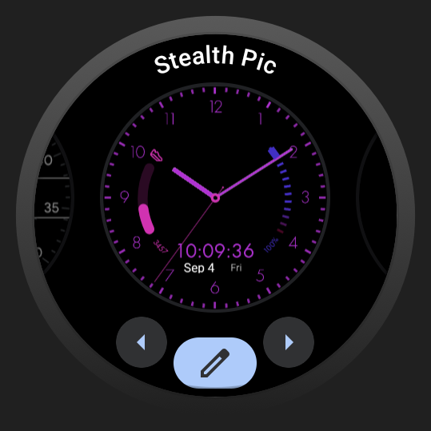
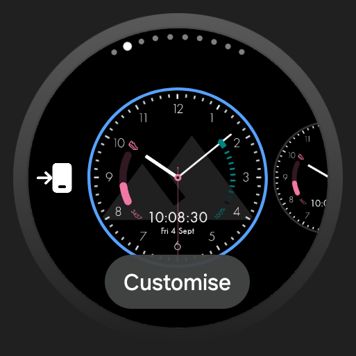
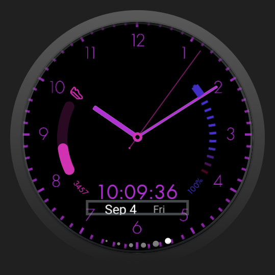
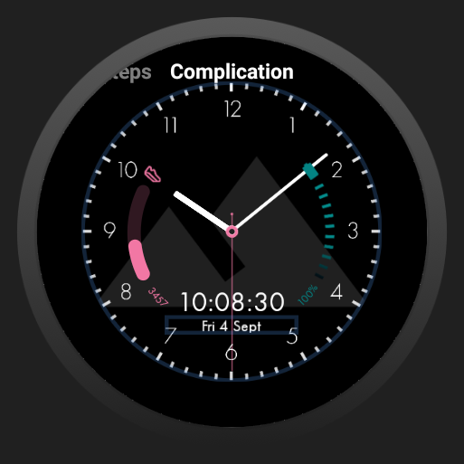
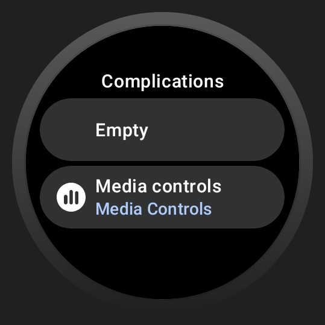
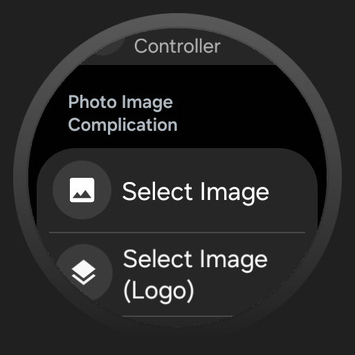
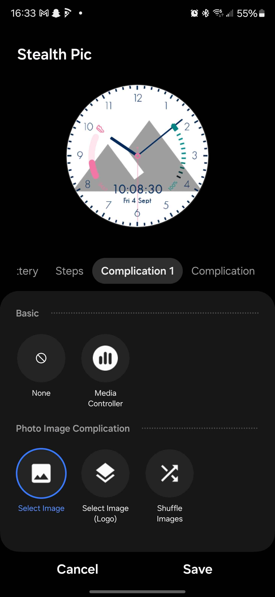

# Stealth Pic Custom Background Guide
Unfortunately, as of January 2025, there no native solution to set an image as a complication. To use custom images, you will need a complication source to supply your desired image. I recommend [Photo Complication for Wear OS](https://play.google.com/store/apps/details?id=com.weartools.photocomplication) from [amoledwatchfaces](https://amoledwatchfaces.com/) as you can select multiple images to be shown in a slideshow.

## Photo Complication for Wear OS
Once you have Photo Complication for Wear OS (or a similar app that adds photo complications), you can perform the following steps to set your new background.
1. Hold down on the watch face

2. After holding down on the watch face, you should click the edit/customize button.

    
    

3. Navigate to the right-most section. This is where all of your standard complications are. Click on the background.

    
    

4. Set the complication to your image provider (not shown for stock Wear OS option).

    
    

Alternatively, in the Samsung 'Wearable' app, it looks something like this if you have Photo Complication for Wear OS installed. 

🎉 Yay! You should now have your custom background!